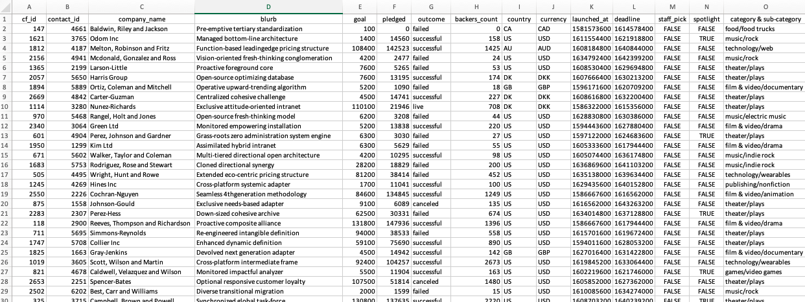
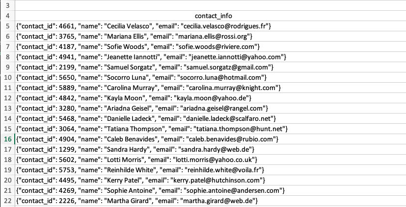

# ETL Pipeline for Crowdfunding Project

In this project, I had to design a PostgreSQL database and populate it with initial data from excel files.

The initial data came in two excel files: [crowdfunding.xlsx](./data/crowdfunding.xlsx) and [contacts.xlsx](./data/contacts.xlsx)
 
Crowdfunding Data Screenshot

This file contains the usual data about each campaign like company name, description, goal, pledged, outcome, date, and etc.

Contacts Data Screenshot

As can be seen in the screenshot above, the contact data is presented in a column where each row is a separate contact in a json format string.

## Part I - Database Design

After examining the data structure in the excel files, the database design was fairly straightforward. To normalize the data, the database was split into four tables: campaigns, contacts, category, and subcategory. Below is the schema for the crowdfunding database with more details.

Schema for Crowdfunding DB

The DDL statement for creating the database tables is in [crowdfunding_db_schema.sql](./data/crowdfunding_db_schema.sql)

## Part II - Data Transformation

The complete data transformation code with comments can be viewed/run in [Google Colab file](https://colab.research.google.com/drive/1MRl_WjTvi3lGDZZSYPLk0XzQCubmVqv8?usp=sharing) which is a replica of Jupiter notebook [crowdfunding_excel_psql.ipynb](./crowdfunding_excel_psql.ipynb) in this repository.

Crowdfunding data was loaded into pandas DataFrame. Since the category and subcategory values were stored in the same column separated by a slash (/), they had to be split into separate columns. The unique values were then extracted into separate data frames: category and subcategory. The unique ids were populated for each category and subcategory. The data frames were then saved as CSV files: [category.csv](./data/category.csv) and [subcategory.csv](./data/subcategory.csv). 

Contacts data from [contacts.xlsx](./data/contacts.xlsx) were loaded into a pandas DataFrame. A series of transformations were applied to the contacts data to convert them into a format that can be imported into a Postgres database. More details in [Google Colab file](https://colab.research.google.com/drive/1MRl_WjTvi3lGDZZSYPLk0XzQCubmVqv8?usp=sharing). Restructured contacts data was saved as [contacts.csv](./data/contacts.csv).

## Part III - Data Loading

After the database was created, the CSV files were manually imported.

## Technologies
Python, PostgreSQL, SQL, DDL, Jupiter Notebooks, Excel, pandas.

