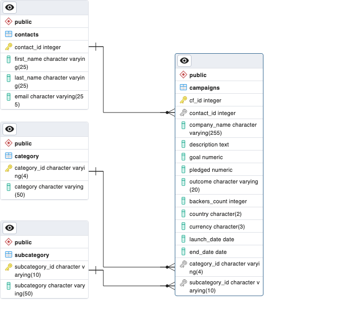

# ETL Pipeline for Crowdfunding Project

In this project, I had to design a PostgreSQL database and populate it with initial data from excel files.

The initial data came in two excel files: [crowdfunding.xlsx](./data/crowdfunding.xlsx) and [contacts.xlsx](./data/contacts.xlsx)
 

Schema for Crowdfunding DB

Ran schema SQL from crowdfunding_db_schema.sql. Imported csv files into category, subcategory, contacts and campaign tables. 
